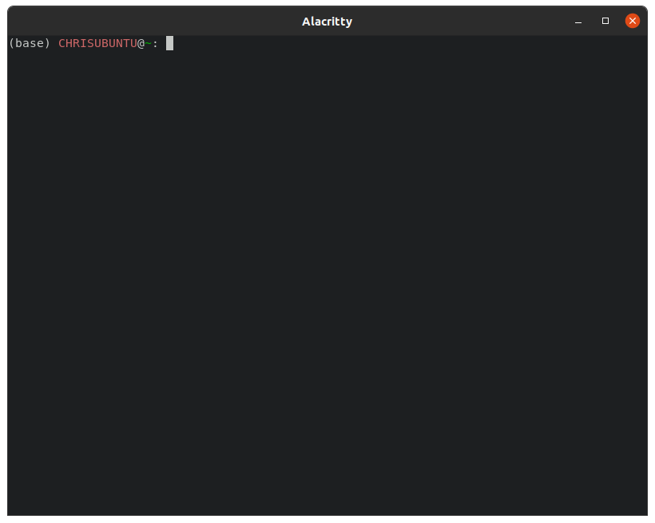
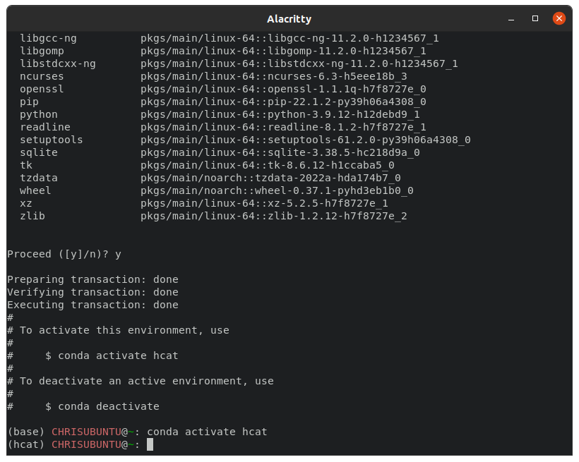
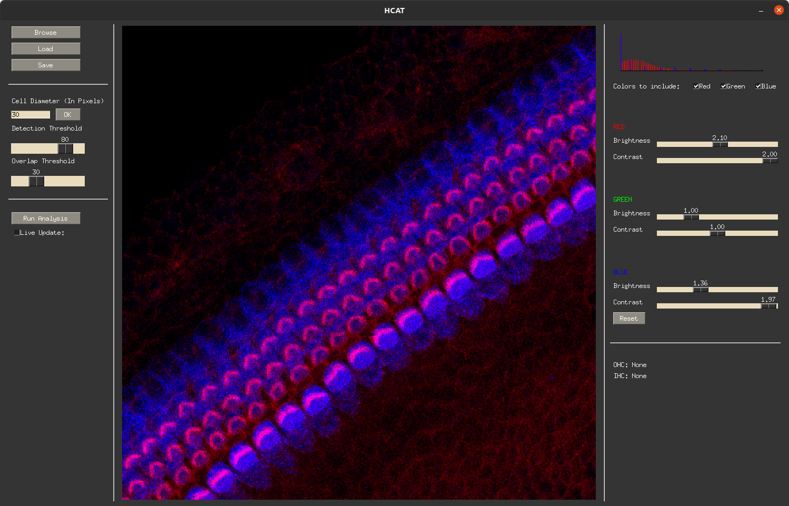
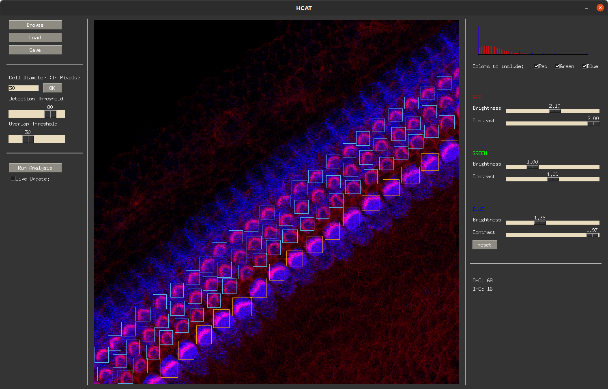

# HCAT - Hair Cell Analysis Toolbox

Hcat is a suite of machine learning enabled algorithms for performing common image analyses in the hearing field.
At present, it performs one fully automated analyses: (1) 2D hair cell detection

HCAT is highly accurate for most cochlear tissue, very fast, and easy to integrate into existing workflows!
For full documentation, please visit: [hcat.readthedocs.io](https://hcat.readthedocs.io/en/latest/)

---
## Quickstart Guide
#### Installation
1) Install [Anaconda](https://www.anaconda.com/)
2) Perform the installation by copying and pasting the following comands into your *Anaconda Prompt* (Windows) or *Terminal* (Max/Linux)
3) Create a new anaconda environment: `conda create -yn hcat python=3.9`
4) Activate the anaconda environment: `conda activate hcat`
> **WARNING**: You will need to avtivate your conda environment every time you restart your prompt!
5) Install pytorch for CPU ONLY: `conda install pytorch torchvision torchaudio cpuonly -c pytorch`
6) Install hcat and dependencies: `pip install hcat --upgrade` 
7) Run hcat: `hcat`

> **NOTE**: It is strongly recommended you follow the installation guide for correct installation!

> **NOTE**: Follow the detailed installation guide for instructions on how to enable GPU acceleration 

Detection Gui:
* Run in terminal: `hcat`

CLI Hair Cell Detection Analysis:
* Run in terminal: `hcat detect "path/to/file.tif"`
---

## Requirements
The following requirements are necessary to run `hcat`. 

* Pytorch 1.12.0
* Torchvision 0.13.0
* python 3.9

## Detailed Installation
To install hcat, ensure you that **Python Version 3.9** as well as all dependencies properly installed. It is recommended
to use the [Anaconda](https://www.anaconda.com/) distribution of python with a dedicated environment. To do a reccomendned install, 
please use the following steps. 

1) Download the Anaconda distribution of python from the following link: [Anaconda](https://www.anaconda.com/). This will install
python for you! There is **no need** to install python from an additional source. 
2) On Windows, launch the `Anaconda Prompt` application. On Mac or Linux launch a new `terminal`. If installed correctly you 
should see `(base)` to the left of your terminal input.  This is your anaconda `environemnt`.
3) To avoid dependency issues, we will create a new environment to install hcat. This acts like an isolated sandbox where
we can install specific `versions` necessary software. To do this, in the prompt, type `conda create -n hcat python=3.9` and type `y` when asked. 
 This creates an environment to install our software. We must now activate this environment to
access our isolated sandbox and install `hcat`. 
4) To activate our environment, type in the terminal `conda activate hcat`. Notice how `(base)` has been replaced with `(hcat)`.
 
5) To run hcat we first need to install `pytorch`, a deep learning library. To do this, follow the instructions on the
[Pytorch](https://pytorch.org/get-started/locally/) website for your particular system. It is recommended to use these install settings:

| Setting          | Selection                                                |
|------------------|----------------------------------------------------------|
| PyTorch Build    | Stable (1.12.0)                                          |
| Your OS          | Linux/Mac/Windows                                        |
| Package          | Conda                                                    |
| Language         | Python                                                   |
| Compute Platform | CUDA 11.3 (If you have an Nvidia GPU, otherwise use CPU) |

This will create a command to run in the prompt. With these settings, this might look like: `conda install pytorch torchvision torchaudio cudatoolkit=11.3 -c pytorch`.
This may take a while. 

>**NOTE**: Installing pytorch with pip can cause issues in some systems. To ensure GPU capabilities and 
> prevent errors, please install with the package manager `Conda`.

6) Once we've installed pytorch, we can use the command line to install `hcat`. To do this, type `pip install hcat --upgrade`. This command will install all
remaining libraries necessary to run the software into our protected sandbox environment. This means that the software can only be
called from the hcat environment. 

7) If the installation finishes with no errors, we can run `hcat` by simply typing `hcat` in the prompt! 

> **WARNING**: If you restart your prompt or terminal, you will need to reactivate the environment to launch the program. 


---
## Detection Gui
We provide an easy to use gui to the performance of hcat's detection capabilites on your own data. To launch the gui and 
analyze your own data, please follow the following steps. 

1) Open a terminal (Mac/Linux) or Anaconda Prompt (Windows) and type: `conda activate hcat`
2) Verify the environment is activated by `(hcat)` being displayed to the left of the input prompt
3) Type `hcat` in the prompt to launch the gui

A gui should launch. 

4) On the top left, click browse to select a file, then load to load the file into the software. The image should be displayed on the screen.

5) Enter the diameter of the cell in pixels. Best measured in ImageJ. Click 'OK'
6) De-select the channels not representing the cell cytosol and hair bundle. 
7) Adjust the brightness and contrast of the image to minimize background fluorescence. 

8) Press 'Run Analysis'. A pretrained model will download off the internet and loaded into the software. This may take a few minutes and should only happen once. 
9) Predictions should appear on screen. Fine tune the predictions by adjusting the cell probability rejection threshold and prediction box overlap threshold.
   
10) Press 'Save' to save the analysis to a CSV and JPG. This will create two new files in the same location as your image called: `<filename>_analysis.csv` and `<filename>_analysis.jpg`

---
## Comand Line Usage
The comand line tool has two entry points: **detect**, and **segment (Beta)**. 
* **detect** takes in a 2D, multichannel maximum projection of a cochlea and predicts inner and outer hair cell detection predictions
* **segment (Beta)** takes in a 3D, multichannel volume of cochlear hair cells and generates unique segmentation masks which which may be used 


### Detect

---
`hcat detect` is the entrypoint for the detection of hair cells from max projection tilescans of a cochlea.
Hair cell detection is one of the most basic tasks in cochlear image analysis;
useful for evaluating cochlear trauma, aging, ototoxicity, and noise exposure. To evaluate an image, run the following in
the command line:

`hcat detect [INPUT] [OPTIONS]`

#### INPUT

The program accepts confocal max-projected z-stacks of cochlear hair cells stained with a hair cell specific cytosol stain
(usually anti-Myo7a) _**and**_  a stereocilia stain (ESPN, phalloidin, etc...). The input image must only have these 2 channels. This may be easiest achieved with the Fiji application. The best performing images will have
high signal-to-noise ratio and low background staining.

#### OPTIONS
    --cell_detection_threshold        (float) Rejection for objects with mean cytosolic intensity below threshold
    --curve_path                      (str) Path to collection of points for curve estimation
    --dtype                           (str) Data type of input image: (uint8 or uint16)
    --save_fig                        (flag) Render diagnostic figure containing cell detection information
    --save_xml                        (flag) Save detections as xml format compatable with labelImg software
    --pixel_size                      (int) X/Y pixel size in nm
    --cell_diameter                   (int) Rough diameter of hair cell in pixels


#### OUTPUT

The program will save two files with the same name and in the same location as the original file: `filename.csv` and
`filename.cochlea`.
* `filename.csv` contains human-readable data on each hair cell segmented in the original image.
* `filename.cochlea` is a dataclass of the analysis which is accessible via the python programing language
  and contains a compressed tensor array of the predicted segmentation mask.

To access `filename.cochela` in a python script:

```python
import torch
from hcat.lib.cell import Cell
from typing import List

# Detected cells are stored as "Cell" objects 
cochlea = torch.load('filename.cochlea')
cells: List[Cell] = cochlea.cells

# To access each cell:
for cell in cells:
    print(cell.loc, cell.frequency) #location (x, y, z); frequency (Hz)
```
Please visit the official documentation for more details!

---

## Common Issues

1. _**The program doesn't predict anything**_: This is most likely a channel issue. The machine learning backbones to each
   model is not only channel specific, but also relies on **specific channel ordering**. Check the `--channel` flag is set
   properly for `hcat segment`. For `hcat detect` check that the order of your channels is correct (cytosol then hair bundle).
2. _**The program still doesn't show anything**_: If it is not the channel, then it is likely a datatype issue. Ensure you are
   passing in an image of dtype **uint8** or **uint16**. This can be double checked in the `fiji` application by clicking the
   `Image` dropdown then clicking `type`, it should show either 8-bit or 16-bit.
3. _**I cannot find the output**_: The program saves the output of each analysis as a CSV file with the same name
   in the same location as the original file! Beware, subsequent excecutions of this program will overwrite previous analysis files.
